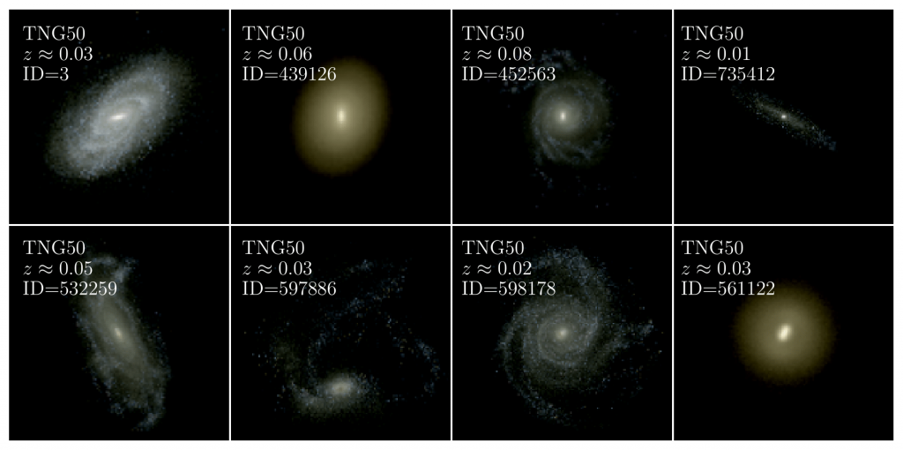

## iMaNGA: mock MaNGA galaxies based on illustrisTNG to test our theory on galaxy formation and evolution
We developed a method to generate mock galaxies from the hydro-dynamical IllustrisTNG simulations which are suited to compare
with integral field spectroscopic observation of galaxies from the SDSS-IV/MaNGA survey ([Nanni et al. 2022](https://www.google.com/search?q=imanga+mnras&oq=imanga+mnras&aqs=chrome.0.69i59j69i61j69i65j69i60j69i61.1736j1j7&sourceid=chrome&ie=UTF-8)). We also developed a pipeline to test the observational results against the theoretical predictions in terms of general catalogue characteristics ([Nanni et al. 2023a](https://academic.oup.com/mnras/article/522/4/5479/7150712)) and stellar population properties ([Nanni et al. 2023b](https://arxiv.org/abs/2309.14257)).

Updates on the project will be posted on the [official website](http://www.icg.port.ac.uk/imanga/).

For information, contact lorenza.nanni@port.ac.uk

# iMaNGA: Data availability 
All the datacubes are available here: https://www.tng-project.org/data/docs/specifications/#sec5_4

The iMaNGA VAC is available at the same link. This catalogue contains all the galaxy information such as general properties, morphology, kinematics and  stellar population properties as computed by photometric and full spectral fitting codes ([Nanni et al. 2023b](https://arxiv.org/abs/2309.14257))

# iMaNGA: Codes

[iMaStar](https://github.com/lonanni/iMaNGA/blob/main/iMaStar_Example.ipynb) : Here, we have a jupyter-notebook example of how to go from particle information to IFU datacubes with MaStar and MappingsIII spectra, accounting for the kinematics as well. To run this example, [Data](https://github.com/lonanni/iMaNGA/tree/main/Data/snap96gal3) are provided.

[iMaNGA VAC](https://github.com/lonanni/iMaNGA/blob/main/iMaNGA_VAC_Example.ipynb) : Here, we have an example of how the iMaNGA VAC can be used for scientific analysis 

[iMANGA](https://github.com/lonanni/iMaNGA/blob/main/iMANGA_mockMaNGAdatacubes.ipynb) : Here, we make available the code to go from iMaNGA synthetic+dust attenuated datacubes (provided, see above) to a mock MaNGA observation.  This code can be applied to any other synthetic datacube. It can be modified to obtain other mock observations, with straightforward changes.

# Accessing Simulations information to run the iMaStar code 
[Illustris TNG Data](https://github.com/lonanni/iMaNGA/blob/main/TNG50_GalaxyFiles.ipynb) : A quick example of how to download data from Illustris/TNG to obtain the necessary data to construct mock observation.

[Eagle Data](https://github.com/lonanni/iMaNGA/blob/main/EAGLE.ipynb) : A quick example of how to download particle data from Eagle snapshots to run the iMaStar code.

If you use any of these codes, entirely on in some of their parts, for scientific publications, please, cite [Nanni et al. 2023b](https://arxiv.org/abs/2309.14257).

